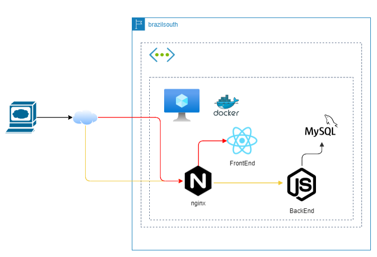

<<<<<<< HEAD
# 🚀 Sistema de tarefas - Projeto DimDim

Parabéns! 🎉 Você foi selecionado para integrar o **Time Sparta** da **Instituição Financeira DimDim**, reconhecida pela tradição em servir bem e pela busca incansável pela excelência. 🏦✨

O **Time Sparta** é responsável pelo **sistema de tarefas** do banco — uma área crítica que ajuda a garantir que todas as operações internas aconteçam de forma organizada, segura e eficiente.

Como parte do processo de modernização, a DimDim está migrando seus sistemas para um **novo ambiente em nuvem na Azure** 🌩️, focado em agilidade, escalabilidade e inovação.

Seu primeiro desafio como membro da equipe é:

- 📦 **Conteinerizar** duas aplicações (uma de backend em Node.js e uma de frontend em React).
- 🛠️ Trabalhar com **Docker**, **Docker Hub** e **Docker Compose** para gerenciar todo o ciclo de vida das aplicações.

Prepare-se para mostrar seu potencial logo de cara! 🚀💼

## ⚠️ REQUISITO OBRIGATÓRIO

**❌ Se não atender este requisito, sua nota será ZERADA! ❌**

Todas as imagens Docker geradas **DEVEM** incluir o arquivo `RM.txt` com o número do seu RM no caminho `/etc/cp2/rm.txt`.

## 📝 Requisitos do Desafio

Para completar seu onboarding no Time Sparta da DimDim, você precisa cumprir os seguintes requisitos:

### 1️⃣ Criar a imagem Docker do Backend

- 🛠️ O projeto backend já está disponível na pasta `backend/`.
- 📦 Crie um `Dockerfile` para empacotar a aplicação Node.js.
- 🐳 Gere a imagem Docker localmente com a tag `seu-usuario-docker/dimdin-backend:latest`.
- 📤 Publique a imagem no seu Docker Hub.

### 2️⃣ Criar a imagem Docker do Frontend

- 🛠️ O projeto frontend está na pasta `frontend/` e foi desenvolvido com **React** + **Vite**.
- 📦 Crie um `Dockerfile` para empacotar essa aplicação também.
- 🐳 Gere a imagem Docker localmente com a tag `seu-usuario-docker/dimdin-frontend:latest`.
- 📤 Publique a imagem no Docker Hub.

### 3️⃣ Criar a imagem Docker do MySQL

- 🗄️ Configure um `Dockerfile` para o MySQL com as credenciais necessárias para o backend.
- 📦 Certifique-se de que o banco de dados será inicializado corretamente quando o container subir.
- 🐳 Gere a imagem Docker com a tag `seu-usuario-docker/dimdin-mysql:latest`.
- 📤 Publique a imagem no Docker Hub.

### 4️⃣ Criar a imagem Docker do Nginx

- 🛠️ O arquivo de configuração do nginx já está disponível em `nginx/default.conf`.
- 📦 Crie um `Dockerfile` na pasta `nginx/` para configurar o nginx como **proxy reverso**.
- 🐳 Gere a imagem Docker com a tag `seu-usuario-docker/dimdin-nginx:latest`.
- 📤 Publique a imagem no Docker Hub.

### 5️⃣ Criar uma Rede Docker

- 🌐 Crie uma rede Docker do tipo `bridge` com o nome `dimdin-network`.
- Esta rede será usada para comunicação entre os containers.

### 6️⃣ Configurar e Executar os Containers com Docker Compose

- 🐳 Crie um arquivo `docker-compose.yml` na raiz do projeto que:
  - Use as **imagens publicadas no Docker Hub** (não as imagens locais).
  - Configure os quatro serviços: `mysql`, `backend`, `frontend` e `nginx`.
  - Todos os containers devem estar conectados à rede `dimdin-network`.
  - Exponha a aplicação na porta `80` através do nginx.
- 🚀 Execute a aplicação com `docker-compose up`.



### 7️⃣ Validar o Funcionamento da Aplicação

- 🌐 A aplicação deve estar acessível externamente a partir da máquina do laboratório através do nginx.
- ✅ Deve ser possível cadastrar uma tarefa com o nome: **"Corrigir a CP do RMXXXX"**, substituindo `XXXX` pelo seu número de RM.
- ✅ Verifique que o backend está respondendo corretamente através do proxy reverso.

## 🎯 Entregáveis

Para a conclusão do desafio, você deve entregar:

- 📁 **Arquivo `student-info.json`** na raiz do projeto contendo:

  ```json
  {
    "rm": "seu-rm",
    "docker_username": "seu-usuario-docker"
  }
  ```

- 📁 Todo o material produzido devidamente versionado no **repositório Git do Classroom**.
  - ❗ Entregas por outros meios não serão aceitas.

- 🖼️ **Prints de evidência** (adicionar à pasta `evidencias/`):
  1. **Tela do navegador** acessando o frontend da aplicação, mostrando a tarefa cadastrada **"Corrigir a CP do RMXXXX"**.

  2. **Comando `docker images`** mostrando as quatro imagens publicadas:
     - `seu-usuario-docker/dimdin-backend:latest`
     - `seu-usuario-docker/dimdin-frontend:latest`
     - `seu-usuario-docker/dimdin-mysql:latest`
     - `seu-usuario-docker/dimdin-nginx:latest`

  3. **Comando `docker network ls`** mostrando a rede `dimdin-network` criada.

  4. **Comando `docker ps`** (ou `docker ps -a`) mostrando os quatro containers em execução:
     - Container do MySQL
     - Container do backend
     - Container do frontend
     - Container do nginx

  5. **Comando `docker inspect dimdin-network`** mostrando os containers conectados à rede.

---

### 🚀💼 Boa sorte, você tem o que é preciso para arrasar nesse desafio! 😉
=======
# 🚀 Sistema de tarefas - Projeto DimDim

Parabéns! 🎉 Você foi selecionado para integrar o **Time Sparta** da **Instituição Financeira DimDim**, reconhecida pela tradição em servir bem e pela busca incansável pela excelência. 🏦✨

O **Time Sparta** é responsável pelo **sistema de tarefas** do banco — uma área crítica que ajuda a garantir que todas as operações internas aconteçam de forma organizada, segura e eficiente.

Como parte do processo de modernização, a DimDim está migrando seus sistemas para um **novo ambiente em nuvem na Azure** 🌩️, focado em agilidade, escalabilidade e inovação.

Seu primeiro desafio como membro da equipe é:

- 📦 **Conteinerizar** duas aplicações (uma de backend em Node.js e uma de frontend em React).
- 🛠️ Trabalhar com **Docker**, **Docker Hub** e **Docker Compose** para gerenciar todo o ciclo de vida das aplicações.

Prepare-se para mostrar seu potencial logo de cara! 🚀💼

## ⚠️ REQUISITO OBRIGATÓRIO

**❌ Se não atender este requisito, sua nota será ZERADA! ❌**

Todas as imagens Docker geradas **DEVEM** incluir o arquivo `RM.txt` com o número do seu RM no caminho `/etc/cp2/rm.txt`.

## 📝 Requisitos do Desafio

Para completar seu onboarding no Time Sparta da DimDim, você precisa cumprir os seguintes requisitos:

### 1️⃣ Criar a imagem Docker do Backend

- 🛠️ O projeto backend já está disponível na pasta `backend/`.
- 📦 Crie um `Dockerfile` para empacotar a aplicação Node.js.
- 🐳 Gere a imagem Docker localmente com a tag `seu-usuario-docker/dimdin-backend:latest`.
- 📤 Publique a imagem no seu Docker Hub.

### 2️⃣ Criar a imagem Docker do Frontend

- 🛠️ O projeto frontend está na pasta `frontend/` e foi desenvolvido com **React** + **Vite**.
- 📦 Crie um `Dockerfile` para empacotar essa aplicação também.
- 🐳 Gere a imagem Docker localmente com a tag `seu-usuario-docker/dimdin-frontend:latest`.
- 📤 Publique a imagem no Docker Hub.

### 3️⃣ Criar a imagem Docker do MySQL

- 🗄️ Configure um `Dockerfile` para o MySQL com as credenciais necessárias para o backend.
- 📦 Certifique-se de que o banco de dados será inicializado corretamente quando o container subir.
- 🐳 Gere a imagem Docker com a tag `seu-usuario-docker/dimdin-mysql:latest`.
- 📤 Publique a imagem no Docker Hub.

### 4️⃣ Criar a imagem Docker do Nginx

- 🛠️ O arquivo de configuração do nginx já está disponível em `nginx/default.conf`.
- 📦 Crie um `Dockerfile` na pasta `nginx/` para configurar o nginx como **proxy reverso**.
- 🐳 Gere a imagem Docker com a tag `seu-usuario-docker/dimdin-nginx:latest`.
- 📤 Publique a imagem no Docker Hub.

### 5️⃣ Criar uma Rede Docker

- 🌐 Crie uma rede Docker do tipo `bridge` com o nome `dimdin-network`.
- Esta rede será usada para comunicação entre os containers.

### 6️⃣ Configurar e Executar os Containers com Docker Compose

- 🐳 Crie um arquivo `docker-compose.yml` na raiz do projeto que:
  - Use as **imagens publicadas no Docker Hub** (não as imagens locais).
  - Configure os quatro serviços: `mysql`, `backend`, `frontend` e `nginx`.
  - Todos os containers devem estar conectados à rede `dimdin-network`.
  - Exponha a aplicação na porta `80` através do nginx.
- 🚀 Execute a aplicação com `docker-compose up`.


### 7️⃣ Validar o Funcionamento da Aplicação

- 🌐 A aplicação deve estar acessível externamente a partir da máquina do laboratório através do nginx.
- ✅ Deve ser possível cadastrar uma tarefa com o nome: **"Corrigir a CP do RMXXXX"**, substituindo `XXXX` pelo seu número de RM.
- ✅ Verifique que o backend está respondendo corretamente através do proxy reverso.

## 🎯 Entregáveis

Para a conclusão do desafio, você deve entregar:

- 📁 **Arquivo `student-info.json`** na raiz do projeto contendo:

  ```json
  {
    "rm": "seu-rm",
    "docker_username": "seu-usuario-docker"
  }
  ```

- 📁 Todo o material produzido devidamente versionado no **repositório Git do Classroom**.
  - ❗ Entregas por outros meios não serão aceitas.

- 🖼️ **Prints de evidência** (adicionar à pasta `evidencias/`):
  1. **Tela do navegador** acessando o frontend da aplicação, mostrando a tarefa cadastrada **"Corrigir a CP do RMXXXX"**.

  2. **Comando `docker images`** mostrando as quatro imagens publicadas:
     - `seu-usuario-docker/dimdin-backend:latest`
     - `seu-usuario-docker/dimdin-frontend:latest`
     - `seu-usuario-docker/dimdin-mysql:latest`
     - `seu-usuario-docker/dimdin-nginx:latest`

  3. **Comando `docker network ls`** mostrando a rede `dimdin-network` criada.

  4. **Comando `docker ps`** (ou `docker ps -a`) mostrando os quatro containers em execução:
     - Container do MySQL
     - Container do backend
     - Container do frontend
     - Container do nginx

  5. **Comando `docker inspect dimdin-network`** mostrando os containers conectados à rede.

---

### 🚀💼 Boa sorte, você tem o que é preciso para arrasar nesse desafio! 😉
>>>>>>> a89ffa86bc8efbbafdee03968b66a96caaa367c4
